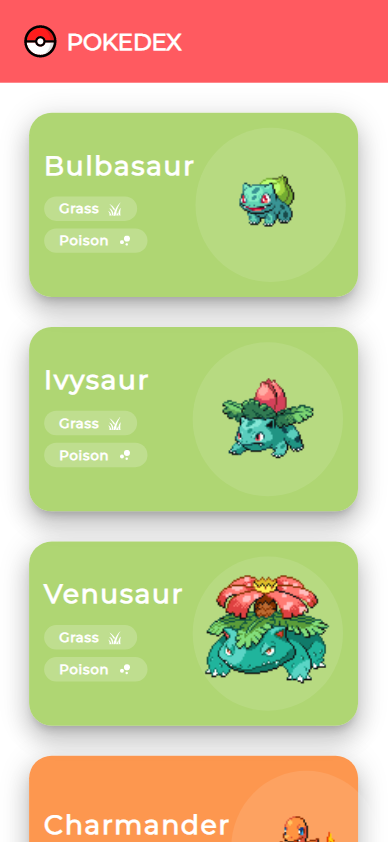
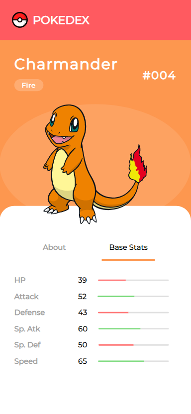
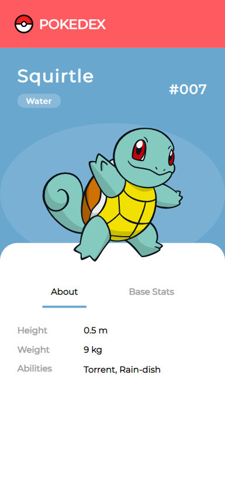

# Pokedex

This is a simple Pokedex application built using React. It displays a list of all 151 original Pokemon and allows the user to click on a Pokemon to view more information about it. The data for the Pokemon is fetched from the [PokeAPI](https://pokeapi.co/docs/v2) API.

## Screenshots

## Getting started

These instructions will get you a copy of the project up and running on your local machine for development and testing purposes.

### Prerequisites

- Node.js
- npm (or yarn)

### Installing

1. Clone the repository

`git clone https://github.com/nikkovacevic/react-pokedex.git`

2. Install the dependencies

`npm install`

3. Start the development server

`npm run dev`

## Built With

- [React](https://reactjs.org/) - A JavaScript library for building user interfaces
- [React Router](https://reactrouter.com/) - A library for routing in React
- [React Query](https://github.com/tannerlinsley/react-query) - A library for performing client-side data caching and fetching in React
- [Material-UI](https://material-ui.com/) - A Material Design library for React
- [Vite](https://vitejs.dev/) - Next Generation Frontend Tooling

## Author

- **Nik Kovačević** - [Github](https://github.com/nikkovacevic)

## To do...

- react-icons
- deployment
